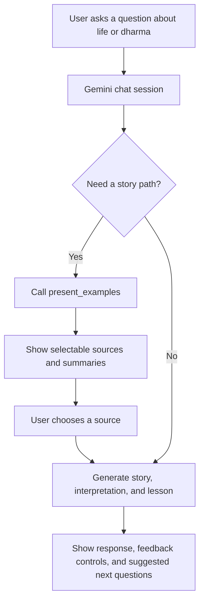
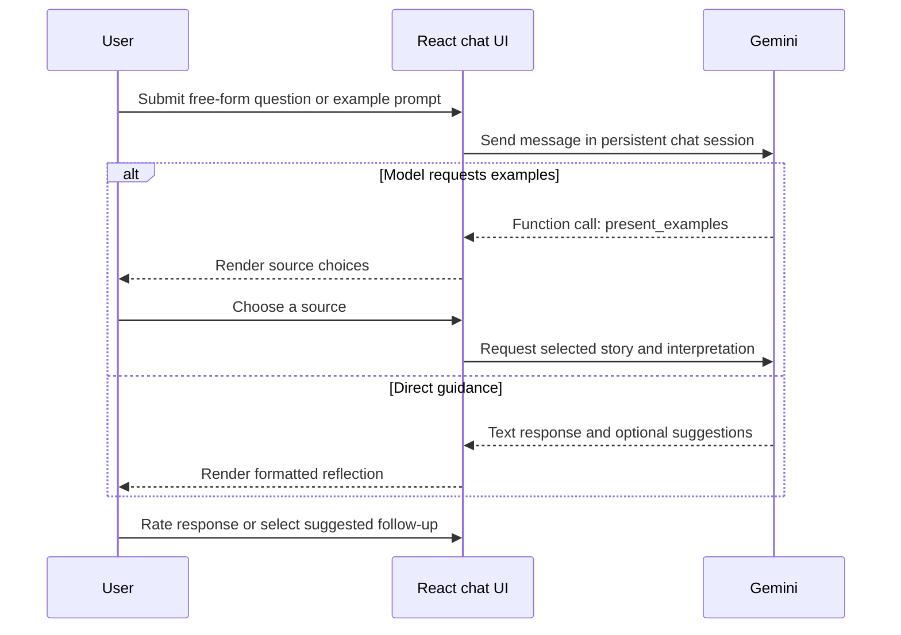
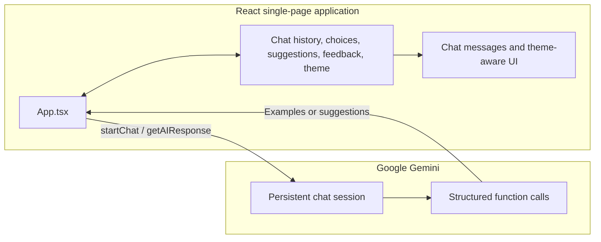

# Veda Vyasa AI — A Guided Vedic Wisdom Companion

> A conversational interface that connects everyday questions to reflective stories, concepts, and life lessons from Indian spiritual and philosophical traditions.

## 🚀 Live Demo

> **Try Veda Vyasa AI in Google AI Studio:** [Open the live demo](https://ai.studio/apps/drive/1Jzaqr-3xaTFioxOz4z30m6Bh4pselh3W)

Veda Vyasa AI is a React and TypeScript chatbot prototype designed as a calm, accessible entry point to Vedic wisdom. Instead of presenting historical material as a static reference, it invites people to begin with a real question—about purpose, work, resilience, duty, peace, or relationships—and frames a response around a relevant tradition, story, and practical reflection.

## The product idea

The core design principle is **guided reflection, not just question answering**. A response can introduce several source-backed story paths; the user selects the one they want to explore. The assistant then develops that selection into a longer explanation with a clear life lesson and suggested follow-up questions.



## Key features

| Feature | What it does |
| --- | --- |
| Guided conversation | Starts with a welcoming “digital sage” persona and a rotating set of example prompts around dharma, karma, leadership, peace, and more. |
| Interactive story paths | Supports a `present_examples` function-call response that renders several source-and-summary choices directly in the chat. |
| Follow-up prompts | Supports a `present_suggestions` function-call response that turns the next step into clickable conversational prompts. |
| Readable long-form responses | Collapses lengthy assistant messages after 400 characters and lets the reader expand them on demand. |
| Context-aware styling | Recognises a curated set of sacred-text keywords and visually distinguishes them inside assistant messages. |
| Reader feedback | Adds thumbs-up/down feedback controls to assistant messages. |
| Four visual moods | Provides Surya (sunrise), Chandra (moonlight), Vana (forest), and Akasha (ether) themes using CSS custom properties. |

## Conversation design



## Architecture



`App.tsx` is the product’s main coordinator. It creates a Gemini chat session on the first question, retains chat state for the active page session, and converts model output into interface states—plain messages, example choices, or suggested questions. The UI is designed around CSS variables defined in `index.html`, which enables the four themes without duplicating component styles.

## Technology stack

- **Frontend:** React 19, TypeScript, Vite
- **Generative AI:** Google Gen AI SDK (`@google/genai`)
- **Styling:** Tailwind utility classes loaded from CDN, custom CSS variables, Google Fonts (Lora and Poppins)
- **Interaction model:** Gemini chat plus structured function calls for selectable examples and follow-up suggestions

## Project structure

```text
sideproject/
├── App.tsx          # Conversation state, tool-call handling, theme selection, chat UI
├── types.ts         # Message and example-choice types
├── icons.tsx        # Reusable SVG icons
├── index.tsx        # React entry point
├── index.html       # Fonts, Tailwind CDN, import map, and theme variables
├── vite.config.ts   # Vite configuration and Gemini environment mapping
├── metadata.json    # AI Studio project metadata
└── package.json     # Scripts and dependencies
```

## Run locally

### Prerequisites

- Node.js 18 or newer
- A Google Gemini API key

### Install

```bash
git clone https://github.com/eshwarpotturi/sideproject.git
cd sideproject
npm install
```

Create `.env.local`:

```dotenv
GEMINI_API_KEY=your_gemini_api_key
```

Then run:

```bash
npm run dev
```

The Vite configuration runs the local server at [http://localhost:3000](http://localhost:3000) and maps `GEMINI_API_KEY` to the client-side Gemini integration.

## Current repository snapshot

The interface and its conversation-state logic are present, but the current repository snapshot needs two import paths restored before a local build can succeed:

1. `App.tsx` imports `./services/geminiService`, but the `services/geminiService.ts` file is not included in the repository.
2. `App.tsx` imports `./components/icons`, while the available icon file is `icons.tsx` at the repository root.

The missing Gemini service is expected to provide the `startChat()` and `getAIResponse()` functions used by the UI. Restoring that service and aligning the icon import with the file structure will make the source repository match the live demo’s intended architecture.

## Production considerations

This is a thoughtful interactive prototype, but a public production release should also add:

- a server-side AI proxy; the current Vite configuration exposes the configured Gemini key to browser code at build time;
- source citation and retrieval support, so responses can link to precise translations or editions rather than only naming traditions;
- clearly defined scope, safety guidance, and a respectful handling policy for spiritual, cultural, and mental-health-sensitive questions;
- persistent, privacy-conscious feedback analytics instead of console-only message feedback; and
- accessibility and localisation testing for a broader set of languages and reading preferences.

## Portfolio highlights

Veda Vyasa AI demonstrates:

- designing a warm, purpose-specific conversational product rather than a generic chat shell;
- translating structured model function calls into intuitive user-choice controls;
- managing persistent conversational state in React;
- building a content-aware reading interface for long-form responses; and
- using a small but expressive design system to create distinct, theme-driven moods.

## License

No license file is currently included. Add one before distributing or accepting external contributions.
